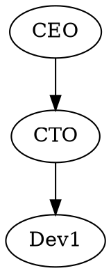
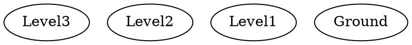

[](https://github.com/navicore/dotspace/actions/workflows/release.yml)
[](https://github.com/navicore/dotspace/actions/workflows/dependabot/dependabot-updates)

# dotspace

Explore your Graphviz dot files in interactive 3D space. Transform static graph diagrams into navigable 3D experiences.


[](LICENSE)

## Features

- **3D Visualization**: Renders Graphviz dot files as interactive 3D scenes
- **Node Types**: Different shapes and colors for various node types (organization, team, user, etc.)
- **Hierarchical Layout**: Automatic vertical and radial positioning based on node levels
- **Interactive Navigation**: 
  - Arrow keys for movement
  - Shift+Arrow keys for camera rotation
  - +/- keys for zoom (Mac-friendly)
- **Unix Philosophy**: Supports both file input and stdin piping
- **Clear Text Labels**: Node labels rendered as overlay text for clarity

## Installation

### Prerequisites

- Rust 1.75 or higher (2024 edition)
- System dependencies for Bevy (automatically handled on most platforms)

### Building from Source

```bash
git clone https://github.com/navicore/dotspace.git
cd dotspace
make build
```

The binary will be available at `target/release/dotspace`.

## Usage

### Basic Usage

```bash
# Visualize a dot file
dotspace graph.dot

# Pipe from another command
cat graph.dot | dotspace

# Generate and visualize on the fly
echo "digraph { A -> B -> C }" | dotspace
```

### Command Line Options

```bash
dotspace [OPTIONS] [FILE]

Arguments:
  [FILE]  Optional dot file path. If not provided, reads from stdin

Options:
  -d, --distance <DISTANCE>  Initial camera distance from center [default: 25.0]
  -s, --speed <SPEED>        Camera movement speed [default: 5.0]
  -h, --help                 Print help
  -V, --version              Print version
```

### Controls

| Key | Action |
|-----|--------|
| Arrow Keys | Move camera forward/backward/left/right |
| Shift + Arrow Keys | Rotate camera around center |
| + / - | Zoom in/out |
| PageUp / PageDown | Alternative zoom controls |
| ESC / Q | Exit application |

## Dot File Features

dotspace supports standard Graphviz dot syntax with additional attributes for 3D visualization:

### Node Types

Specify node types for different shapes and colors:



Available node types:
- `organization` - Red cube (large)
- `lob` (Line of Business) - Orange cylinder
- `site` - Blue torus
- `team` - Green sphere
- `user` - Purple capsule (small)
- (default) - Gray sphere

### Hierarchical Levels

Use the `level` attribute to control vertical positioning:



## Examples

The repository includes several example dot files in the `examples/` directory:

```bash
# Organizational hierarchy
dotspace examples/hierarchy.dot

# Network topology
dotspace examples/network_topology.dot

# Software architecture
dotspace examples/software_architecture.dot

# Simple directed graph
echo 'digraph { rankdir=LR; A -> B -> C -> D; B -> D; }' | dotspace
```

## Development

### Running Tests

```bash
make test
```

### Linting

```bash
# Run clippy with CI settings
make clippy

# Auto-fix clippy warnings
make clippy-fix

# Format code
make fmt
```

### Development Workflow

```bash
# Full check (format, lint, test, build)
make all

# Run with example file
make run

# Run with stdin example
make run-stdin
```

## Architecture

dotspace is built with:
- **Bevy 0.16**: Modern Rust game engine for 3D rendering
- **petgraph**: Graph data structure management
- **clap**: Command-line argument parsing

The visualization uses:
- Custom dot file parser (handles subset of Graphviz syntax)
- Hierarchical layout algorithm with radial distribution
- Bevy's entity-component system for interactive 3D scenes

## Contributing

Contributions are welcome! Please feel free to submit a Pull Request.

1. Fork the repository
2. Create your feature branch (`git checkout -b feature/amazing-feature`)
3. Ensure tests pass and clippy is happy (`make all`)
4. Commit your changes (`git commit -m 'Add amazing feature'`)
5. Push to the branch (`git push origin feature/amazing-feature`)
6. Open a Pull Request

## License

This project is licensed under the MIT License - see the [LICENSE](LICENSE) file for details.

## Acknowledgments

- Built with [Bevy Engine](https://bevyengine.org/)
- Inspired by the need to visualize complex organizational hierarchies and system architectures in 3D
